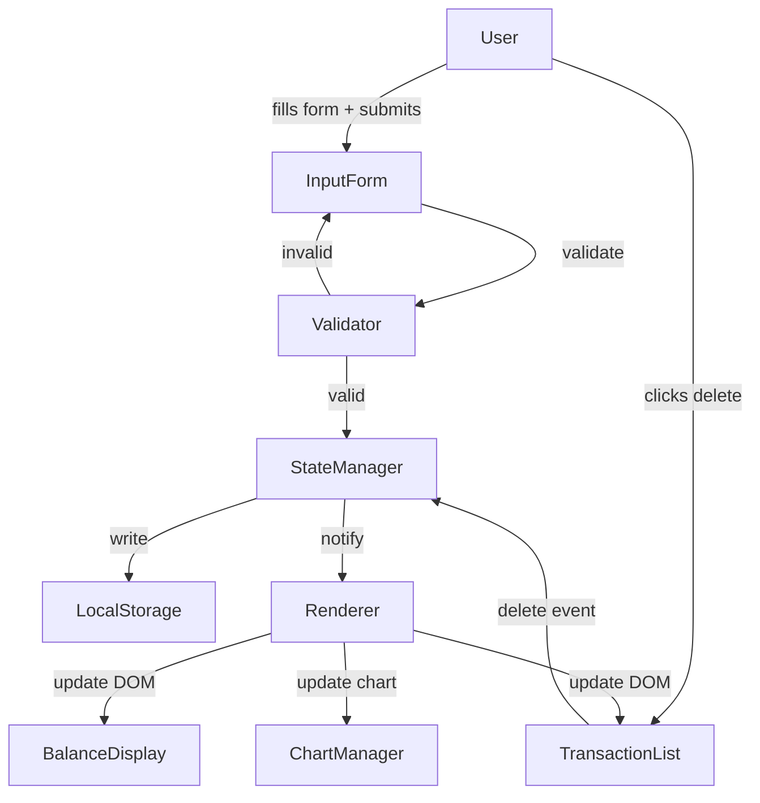
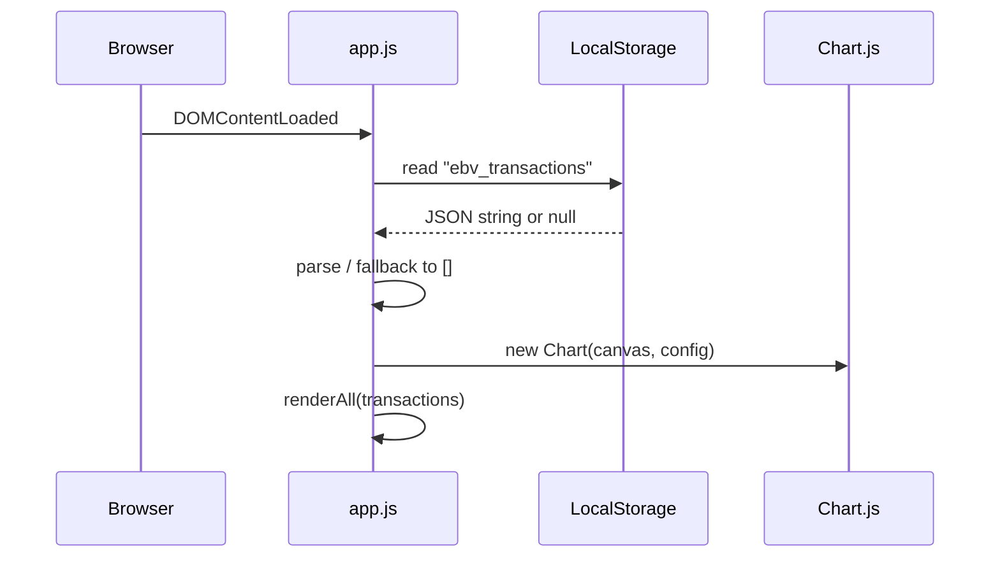

# Design Document: Expense & Budget Visualizer

## Overview

The Expense & Budget Visualizer is a single-page, client-side web application delivered as three files: `index.html`, `css/styles.css`, and `js/app.js`. There is no build step, no server, and no framework. All state lives in memory during a session and is persisted to `localStorage` between sessions. Chart.js is loaded from a CDN and used exclusively for the pie chart.

The application renders four logical UI regions on one page:

- **Input_Form** — form for entering a new transaction
- **Balance_Display** — running total of all transaction amounts
- **Transaction_List** — scrollable list of all recorded transactions
- **Chart** — pie chart showing spending distribution by category

Every user action (add or delete a transaction) triggers a synchronous update cycle that refreshes all four regions and writes to `localStorage` in a single pass.

---

## Architecture

### File and Folder Structure

```
expense-budget-visualizer/
├── index.html          # Single HTML page; all markup and CDN script tags
├── css/
│   └── styles.css      # All styling; no inline styles in HTML
└── js/
    └── app.js          # All application logic; no other JS files
```

### High-Level Data Flow



### Initialization Flow



---

## Components and Interfaces

### Component Responsibilities

| Component | Responsibility |
|---|---|
| **Input_Form** | Collects name, amount, category; triggers validation and submission |
| **Validator** | Checks field values; returns error details or null |
| **Balance_Display** | Shows formatted sum of all transaction amounts |
| **Transaction_List** | Renders each transaction row with a delete button |
| **Chart** | Pie chart of per-category totals via Chart.js |
| **StateManager** | Owns the in-memory transaction array; coordinates updates |
| **ChartManager** | Wraps the Chart.js instance; exposes a single `update(data)` method |
| **StorageManager** | Wraps `localStorage`; handles serialization and parse errors |

### HTML Structure (index.html)

```html
<body>
  <header>
    <h1>Expense & Budget Visualizer</h1>
    <div id="balance-display">...</div>
  </header>

  <main>
    <section id="form-section">
      <!-- Input_Form -->
      <form id="transaction-form">
        <input  id="item-name"   type="text"   />
        <input  id="item-amount" type="number" />
        <select id="item-category">
          <option value="">Select category</option>
          <option value="Food">Food</option>
          <option value="Transport">Transport</option>
          <option value="Fun">Fun</option>
        </select>
        <button type="submit">Add Expense</button>
        <div id="form-errors" aria-live="polite"></div>
      </form>
    </section>

    <section id="chart-section">
      <canvas id="spending-chart"></canvas>
      <p id="chart-empty-msg" hidden>No data to display.</p>
    </section>

    <section id="list-section">
      <ul id="transaction-list" aria-label="Transaction list"></ul>
      <p id="list-empty-msg">No expenses recorded yet.</p>
    </section>
  </main>

  <!-- Chart.js CDN -->
  <script src="https://cdn.jsdelivr.net/npm/chart.js"></script>
  <script src="js/app.js"></script>
</body>
```

### JavaScript Module Breakdown (js/app.js)

`app.js` is a single IIFE (Immediately Invoked Function Expression) that exposes no globals. Internal sections are separated by comment banners.

```
// ── Constants ──────────────────────────────────────────────
// ── StorageManager ─────────────────────────────────────────
// ── StateManager ───────────────────────────────────────────
// ── Validator ──────────────────────────────────────────────
// ── Renderer ───────────────────────────────────────────────
// ── ChartManager ───────────────────────────────────────────
// ── EventHandlers ──────────────────────────────────────────
// ── Init ───────────────────────────────────────────────────
```

#### Function Signatures

**Constants**
```js
const STORAGE_KEY = 'ebv_transactions';
const CATEGORIES  = ['Food', 'Transport', 'Fun'];
const CATEGORY_COLORS = { Food: '#FF6384', Transport: '#36A2EB', Fun: '#FFCE56' };
```

**StorageManager**
```js
StorageManager.load()          // → Transaction[] | []   (never throws)
StorageManager.save(txns)      // → void                 (writes JSON to localStorage)
```

**StateManager**
```js
StateManager.init(txns)        // → void   (sets internal array from loaded data)
StateManager.getAll()          // → Transaction[]
StateManager.add(txn)          // → void   (push + save + renderAll)
StateManager.remove(id)        // → void   (filter + save + renderAll)
```

**Validator**
```js
Validator.validate(name, amount, category)
// → null                  if all fields are valid
// → { field, message }[]  if one or more fields are invalid
```

**Renderer**
```js
Renderer.renderAll(txns)       // → void   (calls renderList + renderBalance + ChartManager.update)
Renderer.renderList(txns)      // → void   (rebuilds #transaction-list DOM)
Renderer.renderBalance(txns)   // → void   (updates #balance-display text)
Renderer.showFormErrors(errs)  // → void   (populates #form-errors)
Renderer.clearFormErrors()     // → void
```

**ChartManager**
```js
ChartManager.init(canvas)      // → void   (creates Chart.js instance)
ChartManager.update(txns)      // → void   (recalculates per-category totals and calls chart.update())
```

**EventHandlers**
```js
EventHandlers.onFormSubmit(e)  // → void   (reads fields, validates, calls StateManager.add)
EventHandlers.onDeleteClick(e) // → void   (reads data-id, calls StateManager.remove)
```

**Init**
```js
function init() {
  const txns = StorageManager.load();
  StateManager.init(txns);
  ChartManager.init(document.getElementById('spending-chart'));
  Renderer.renderAll(txns);
  document.getElementById('transaction-form')
    .addEventListener('submit', EventHandlers.onFormSubmit);
  document.getElementById('transaction-list')
    .addEventListener('click', EventHandlers.onDeleteClick);  // event delegation
}
document.addEventListener('DOMContentLoaded', init);
```

---

## Data Models

### Transaction Object

```js
{
  id:        string,   // crypto.randomUUID() — unique identifier
  name:      string,   // item name; non-empty after trim
  amount:    number,   // positive float, stored as JS number
  category:  string,   // one of: "Food" | "Transport" | "Fun"
  timestamp: number    // Date.now() at time of creation
}
```

### Local Storage Schema

- **Key**: `"ebv_transactions"`
- **Value**: JSON-serialized array of Transaction objects

```json
[
  {
    "id": "550e8400-e29b-41d4-a716-446655440000",
    "name": "Lunch",
    "amount": 12.50,
    "category": "Food",
    "timestamp": 1700000000000
  }
]
```

On `StorageManager.load()`:
- If the key is absent → return `[]`
- If `JSON.parse` throws → log the error, display a user-facing error message, return `[]`

On `StorageManager.save(txns)`:
- Call `localStorage.setItem(STORAGE_KEY, JSON.stringify(txns))`
- Wrap in try/catch; if it throws (e.g., storage quota exceeded), display a user-facing warning

### Category Totals (derived, not stored)

Computed on every `ChartManager.update(txns)` call:

```js
const totals = CATEGORIES.reduce((acc, cat) => {
  acc[cat] = txns
    .filter(t => t.category === cat)
    .reduce((sum, t) => sum + t.amount, 0);
  return acc;
}, {});
```

---

## Chart.js Integration

Chart.js is loaded via CDN before `app.js`:

```html
<script src="https://cdn.jsdelivr.net/npm/chart.js"></script>
```

`ChartManager.init` creates a single `Chart` instance and stores it in a closure variable. `ChartManager.update` mutates `chart.data.datasets[0].data` and `chart.data.labels` in place, then calls `chart.update()` — this avoids destroying and recreating the instance on every change, which preserves Chart.js animations.

```js
// ChartManager (internal)
let chartInstance = null;

ChartManager.init = function(canvas) {
  chartInstance = new Chart(canvas, {
    type: 'pie',
    data: {
      labels: CATEGORIES,
      datasets: [{
        data: [0, 0, 0],
        backgroundColor: CATEGORIES.map(c => CATEGORY_COLORS[c])
      }]
    },
    options: {
      responsive: true,
      plugins: {
        legend: { position: 'bottom' }
      }
    }
  });
};

ChartManager.update = function(txns) {
  const totals = computeCategoryTotals(txns);
  chartInstance.data.datasets[0].data = CATEGORIES.map(c => totals[c]);
  chartInstance.update();

  // Toggle empty-state message
  const isEmpty = txns.length === 0;
  document.getElementById('chart-empty-msg').hidden = !isEmpty;
  canvas.style.display = isEmpty ? 'none' : 'block';
};
```

**Empty state**: When `txns` is empty, the canvas is hidden and `#chart-empty-msg` is shown. When data is present, the canvas is shown and the message is hidden.

---

## Validation Logic

`Validator.validate(name, amount, category)` returns `null` on success or an array of error objects on failure.

| Field | Rule | Error message |
|---|---|---|
| `name` | `name.trim().length > 0` | "Item name is required." |
| `amount` | `isFinite(amount) && amount > 0` | "Amount must be a positive number." |
| `category` | `CATEGORIES.includes(category)` | "Please select a category." |

The raw `amount` value from the `<input type="number">` is read as `parseFloat(input.value)`. An empty field produces `NaN`, which fails `isFinite`.

`Renderer.showFormErrors(errs)` injects one `<p>` element per error into `#form-errors`. Each `<p>` has a class of `error-msg` for styling. The container uses `aria-live="polite"` so screen readers announce errors without interrupting the user.

`Renderer.clearFormErrors()` empties `#form-errors` before each submission attempt.

---

## Event Flow

### Add Transaction

```
1. User fills Input_Form and clicks "Add Expense"
2. EventHandlers.onFormSubmit(e) fires
   a. e.preventDefault()
   b. Read name, amount, category from DOM
   c. Renderer.clearFormErrors()
   d. errors = Validator.validate(name, amount, category)
   e. IF errors → Renderer.showFormErrors(errors); return
3. Build Transaction object { id, name, amount, category, timestamp }
4. StateManager.add(txn)
   a. Push txn to internal array
   b. StorageManager.save(array)
   c. Renderer.renderAll(array)
      i.  Renderer.renderList(array)   → rebuild #transaction-list
      ii. Renderer.renderBalance(array) → update #balance-display
      iii.ChartManager.update(array)   → mutate chart data + chart.update()
5. Reset form fields (form.reset())
```

### Delete Transaction

```
1. User clicks delete button on a transaction row
2. Event bubbles to #transaction-list (event delegation)
3. EventHandlers.onDeleteClick(e) fires
   a. Check e.target matches [data-action="delete"]
   b. Read id = e.target.closest('li').dataset.id
4. StateManager.remove(id)
   a. Filter internal array to exclude matching id
   b. StorageManager.save(array)
   c. Renderer.renderAll(array)
      i.  Renderer.renderList(array)
      ii. Renderer.renderBalance(array)
      iii.ChartManager.update(array)
```

### Page Load

```
1. DOMContentLoaded fires
2. init() runs
   a. StorageManager.load() → txns (or [] on error)
   b. StateManager.init(txns)
   c. ChartManager.init(canvas)
   d. Renderer.renderAll(txns)
   e. Attach event listeners
```

---

## Correctness Properties

*A property is a characteristic or behavior that should hold true across all valid executions of a system — essentially, a formal statement about what the system should do. Properties serve as the bridge between human-readable specifications and machine-verifiable correctness guarantees.*

### Property 1: Valid transaction addition grows the list and persists

*For any* existing transaction list and any valid transaction (non-empty, non-whitespace name; positive finite amount; category from the allowed set), adding that transaction should result in the list length increasing by exactly one, the new transaction appearing as the last item, and Storage containing the updated list.

**Validates: Requirements 1.2, 2.2, 5.1**

---

### Property 2: Invalid inputs are rejected with no side effects

*For any* combination of form inputs where at least one field is invalid (name is empty or whitespace-only; amount is zero, negative, or non-numeric; category is absent or not in the allowed set), the Validator should return a non-empty error array identifying the invalid field(s), and the transaction list and Storage should remain byte-for-byte unchanged.

**Validates: Requirements 1.3, 1.4**

---

### Property 3: Balance equals the sum of all transaction amounts

*For any* transaction list (including the empty list), the value produced by the balance calculation should equal the arithmetic sum of all transaction amounts in that list, formatted to exactly two decimal places.

**Validates: Requirements 3.1, 3.2, 3.3, 3.4**

---

### Property 4: Delete removes exactly the targeted transaction

*For any* transaction list containing at least one transaction with a given id, deleting that id should produce a list whose length is exactly one less than the original, that contains no transaction with that id, and that contains every other original transaction with all fields unchanged.

**Validates: Requirements 2.4, 3.3, 5.2**

---

### Property 5: Storage round-trip preserves transaction data

*For any* array of transactions, serializing it to Storage and then deserializing it should produce an array that is deeply equal to the original — same length, same order, and identical field values (id, name, amount, category, timestamp) for every element.

**Validates: Requirements 5.1, 5.2, 5.3**

---

### Property 6: Category totals are consistent with the transaction list

*For any* transaction list, the per-category totals computed for the chart should satisfy two invariants: (a) each category total equals the sum of amounts for all transactions in that category, and (b) the sum of all category totals equals the total balance.

**Validates: Requirements 4.1, 4.2, 4.3**

---

### Property 7: Rendered list reflects transaction data in insertion order

*For any* transaction array, the rendered Transaction_List should contain exactly one list item per transaction, each displaying the correct name, amount formatted to two decimal places, and category, in the same order as the input array.

**Validates: Requirements 2.1, 2.2**

---

## Error Handling

| Scenario | Handling |
|---|---|
| `localStorage` unavailable on load | Catch exception, initialize with `[]`, show banner error message |
| `JSON.parse` fails on load | Catch exception, initialize with `[]`, show banner error message |
| `localStorage.setItem` throws (quota exceeded) | Catch exception, show non-blocking warning; in-memory state is still updated |
| Chart.js CDN fails to load | `ChartManager.init` checks `typeof Chart !== 'undefined'`; if missing, hides canvas and shows a static fallback message |
| `crypto.randomUUID` unavailable | Fallback: `Date.now().toString(36) + Math.random().toString(36).slice(2)` |

All user-facing error messages are injected into dedicated DOM containers (`#form-errors`, `#storage-error-banner`) rather than using `alert()`.